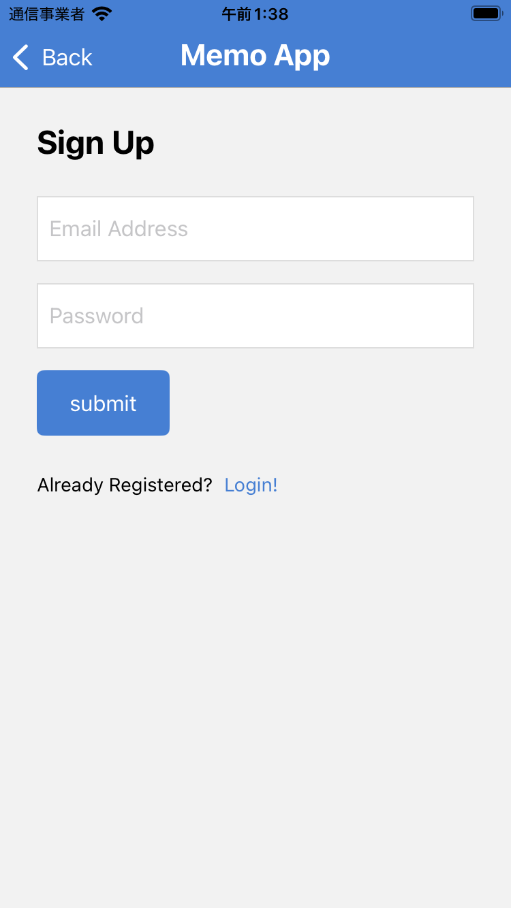
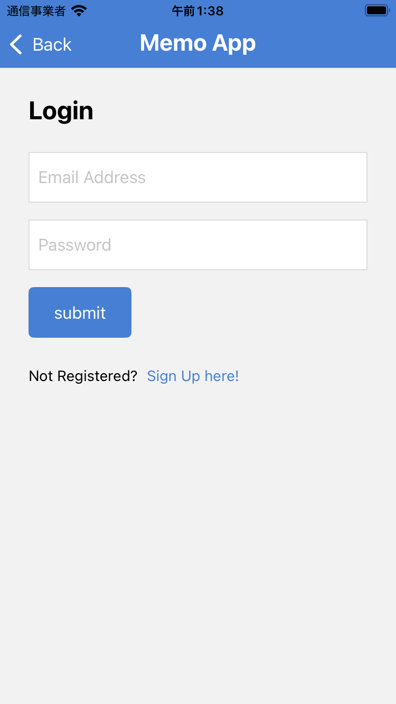
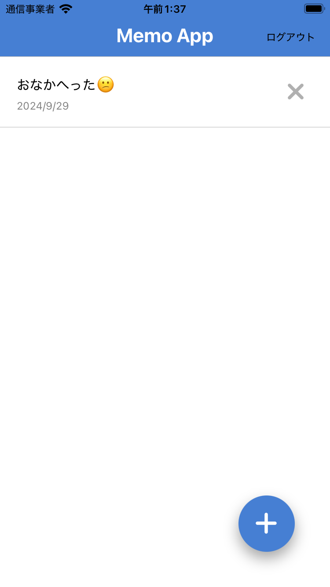
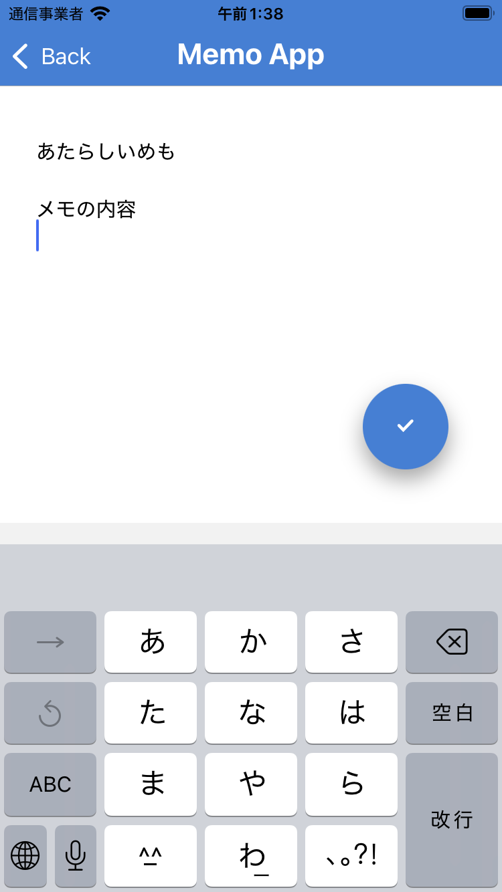
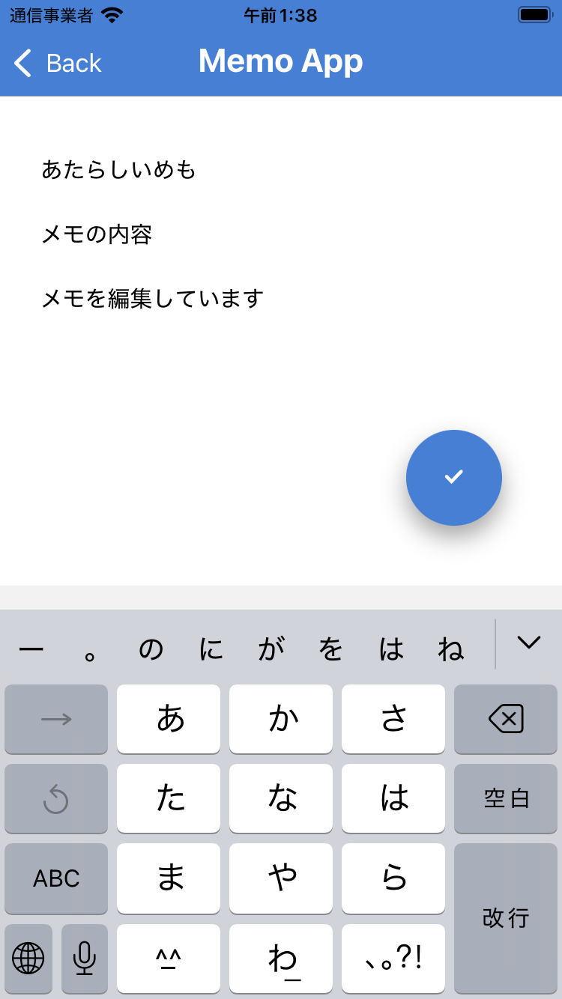

# react-native-memoApp
react-native(expo)とfirebaseを使ったメモアプリです

# feature
* firebaseとfirestoreを使って認証とメモのストアを実現
* react-nativeによるIosアプリ

# Demo
  
  
  
  
  


## package-Memo
```
1. npx crete-expo-app --template

2. npx expo install expo-router react-native-safe-area-context react-native-screens expo-linking expo-constants expo-status-bar react-native-gesture-handler

3. expo-routerはsrc/app配下のファイルごとにルーティングを行う

4. react-nativeはflexboxの向きがデフォルトで縦になっている（Webと逆）

5. npx expo install @expo/vector-icons 

6. npx expo install expo-font  

7. npx expo install firebase @react-native-async-storage/async-storage 

```

